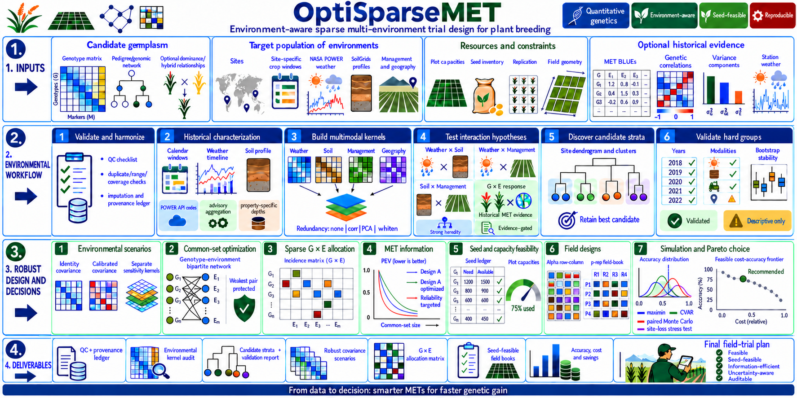

# OptiSparseMET


[](https://github.com/FAkohoue/OptiSparseMET/actions/workflows/R-CMD-check.yaml)
[](https://lifecycle.r-lib.org/articles/stages.html#experimental)

> Sparse multi-environment trial (MET) design that couples **across-environment
> allocation** with **within-environment field layout** under shared genetic,
> environmental, and seed constraints.

---

## Overview

`OptiSparseMET` is an R framework for designing sparse METs. Modern breeding
programmes evaluate more candidate genotypes than any one environment can hold,
environments differ in capacity and precision, and finite seed stocks constrain
both presence and replication. Deciding these separately can yield a design that
is statistically attractive but unplantable, or a feasible field book with weak
cross-environment information. `OptiSparseMET` coordinates all of it —
environmental evidence, common + sparse allocation, network-wide seed
accounting, local field layout, and robust pre-deployment evaluation — and
optimises the two design levels *together*.

The package distinguishes evidence from assumptions: historical MET responses,
when available, calibrate the genetic environmental covariance; when they are
not, it uses a neutral central covariance plus explicit sensitivity scenarios
rather than asking you to invent weights.

At its core it optimises the reliability of across-environment breeding values,
whose precision comes from a **two-level information matrix** that couples the
allocation (through the per-cell information $D$) with the environmental
covariance $\Sigma_E$ and the genomic relationships $G$:

$$
C_{uu} \;=\; D \;-\; D X (X^\top D X)^{-1} X^\top D \;+\;
\sigma_g^{-2}\,\big(\Sigma_E^{-1} \otimes G^{-1}\big).
$$

📘 **[Read the Breeder's Guide](https://FAkohoue.github.io/OptiSparseMET/breeder-guide.html)** ·
📖 **[Full documentation & tutorials](https://FAkohoue.github.io/OptiSparseMET/)**

<p align="center">
  
</p>

---

## What it does

The pipeline runs in nine modules (95 exported functions), each documented in
the [reference index](https://FAkohoue.github.io/OptiSparseMET/reference/) and
demonstrated end-to-end in the pipeline vignette:

1. **Environmental classification** — weather/soil/management kernels, a
   data-driven environmental covariance `Sigma_E`, and mega-environments.
2. **Genetic relationship matrices** — genomic, hybrid/testcross (with optional
   dominance), and made-invertible relationship matrices.
3. **Sparse allocation** — M3/M4 construction plus prediction-optimal,
   robust-prediction, and adaptive-sequential allocation, with optional joint
   optimisation of the common set.
4. **Seed-aware replication** — a single seed inventory turned into a feasible
   per-site replication plan.
5. **Within-environment field design** — block and alpha row-column layouts with
   efficiency evaluation.
6. **Coupled optimisation & information** — the two-level information matrix,
   exact multi-trait index reliability, robust/CVaR optimisation, and Pareto
   frontiers.
7. **Simulation** — Monte-Carlo prediction accuracy and realised genetic gain.
8. **Benchmarking** — paired comparison of reference designs with confidence
   intervals, tail risk, and decision stability.
9. **Field books** — per-site and combined MET field books, and field maps.

For large networks, `met_information()` automatically uses a matrix-free PCG
solver and reports approximation/convergence diagnostics. For fully joint
allocation-replication-layout search, construct a callback with
`fieldbook_design_evaluator()` and pass it to `optimize_design()`. Historical
responses can be fitted directly with `fit_historical_met()` using diagonal,
factor-analytic, or unstructured REML covariance models.

The production path keeps the quantities used for optimisation attached to the
released design. TPE weights, environment-specific residual variances, realised
integer replication, local treatment-information matrices, check-plot overhead,
fieldbooks, solver diagnostics, and provenance can be stored in a validated
`sparse_met_design` object.

For a criterion-driven allocation, ask the public allocator to refine a
feasible M3 or M4 start. The objective, search engine, and common-set policy are
separate controls so the result remains interpretable.

```r
optimal <- allocate_sparse_met(
  treatments = rownames(G), environments = colnames(Sigma_E),
  allocation_method = "prediction_optimal",
  n_test_entries_per_environment = 40,
  G = G, Sigma_E = Sigma_E,
  allocation_criterion = "mean_pev",
  search_method = "annealing",
  common_set = "optimize_jointly",
  common_control = list(count_range = c(4, 12), weight = 0.15),
  seed = 1
)
```

---

## Installation

```r
# install.packages("remotes")
remotes::install_github("FAkohoue/OptiSparseMET",
                        build_vignettes = TRUE, dependencies = TRUE)
```

Set `build_vignettes = FALSE` for a faster install.

---

## Quick start

```r
library(OptiSparseMET)

# Operational one-call pipeline: allocation -> seed -> local design -> field book
out <- plan_sparse_met_design(
  treatments                     = sprintf("H%03d", 1:120),
  environments                   = c("E1", "E2", "E3", "E4"),
  allocation_method              = "random_balanced",
  n_test_entries_per_environment = 41,
  target_replications            = 1
)
out$combined_field_book   # the assembled MET field book
```

Evaluate the realised design with programme-specific TPE weights and residual
variances. The solver is selected automatically; force `solver = "dense"` only
when an exact dense inverse is required and the network is small enough.

```r
info <- met_information(
  out$sparse_allocation$allocation_matrix,
  G = G,
  Sigma_E = Sigma_E,
  sigma_e2 = c(E1 = 1.0, E2 = 1.3, E3 = 0.8, E4 = 1.1),
  tpe_weights = c(E1 = 0.35, E2 = 0.25, E3 = 0.25, E4 = 0.15),
  solver = "auto"
)

info$CDmean
info$solver_diagnostics
```

For historical adjusted responses, estimate the genetic environment covariance
without filling missing genotype-by-environment cells:

```r
fit <- fit_historical_met(
  historical_met,
  genotype_col = "genotype",
  environment_col = "environment",
  response_col = "adjusted_value",
  model = "fa",
  rank = 2
)
Sigma_E <- fit$Sigma_E
```

For the **full scientific pipeline** — from environmental classification through
optimisation, simulation, and benchmarking to the combined field book — see the
tutorial:

```r
vignette("OptiSparseMET-pipeline", package = "OptiSparseMET")
```

---

## Documentation

| Resource | Contents |
|----------|----------|
| [**Pipeline tutorial**](https://FAkohoue.github.io/OptiSparseMET/articles/OptiSparseMET-pipeline.html) | Full end-to-end run of all nine modules on a reproducible example |
| [Introduction](https://FAkohoue.github.io/OptiSparseMET/articles/OptiSparseMET-introduction.html) | Statistical framework, feasibility rules, and input contract |
| [Environmental interactions](https://FAkohoue.github.io/OptiSparseMET/articles/OptiSparseMET-environmental-interactions.html) | Enviromic kernels and interaction evidence |
| [Benchmarking](https://FAkohoue.github.io/OptiSparseMET/articles/OptiSparseMET-benchmarking.html) | Comparing and validating designs before release |
| [Breeder's Guide](https://FAkohoue.github.io/OptiSparseMET/breeder-guide.html) | HTML guide page with an embedded and downloadable PDF |
| [Function reference](https://FAkohoue.github.io/OptiSparseMET/reference/) | All 95 functions, grouped by module |

```r
# After installation:
vignette(package = "OptiSparseMET")   # list all vignettes
```

---

## Citation

If you use `OptiSparseMET` in published research, please cite:

```
Akohoue, F. (2026).
OptiSparseMET: Sparse Multi-Environment Trial Design with Flexible Local
Field Layout. R package version 0.2.0.
https://github.com/FAkohoue/OptiSparseMET
```

## Reference

Montesinos-Lopez O.A., Mosqueda-Gonzalez B.A., Salinas-Ruiz J.,
Montesinos-Lopez A., Crossa J. (2023). Sparse multi-trait genomic prediction
under balanced incomplete block design. *The Plant Genome*, 16, e20305.
<https://doi.org/10.1002/tpg2.20305>

## Contributing

Issues, bug reports, and feature suggestions are welcome:
<https://github.com/FAkohoue/OptiSparseMET/issues>

## License

MIT License © Félicien Akohoue
